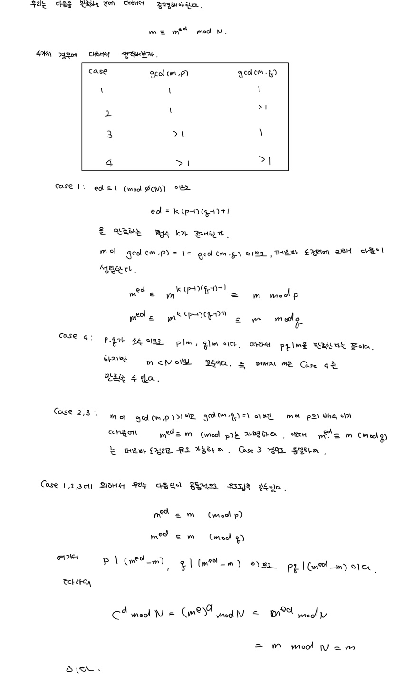

# RSA

1977년 Ron Rivest, Adi Shamir, Leonard Adlenam는 인수분해의 어려움을 기반으로 한 데이터 암호 알고리즘을 제안합니다. 이 세사람의 이름 앞글자를 따서 RSA 암호 알고리즘이라고 합니다. 

## 인수분해의 어려움이란? 
예를 들어서 다음과 같은 수를 인수분해 한다고 해봅시다. 
$$
77
$$

우리는 쉽게 $77 = 7 \times 11$라는 것을 알 수 있을 것입니다. 하지만 다음과 같은 수에 대해서 인수분해 한다고 생각해 봅시다. 

$$
52996757379572180594867981762108780228221062444766492631153167160723917310021
$$

이와 같이 큰 수에 대해서 두개의 소수로 인수분해 하기 어려운 것에 기반한 것이 바로 RSA 입니다. 


하지만 이제 양자컴퓨터가 나오면서 RSA는 사용하지 못한다고 합니다. 그래서 공개키 암호 시스템에 새로운 암호 알고리즘 (격자 기반, 부호 기반)을 세계적으로 공모전을 진행중입니다. 

## 도메인 파라미터
RSA에서 사용되는 파라미터는 다음 세개입니다. 
- $p, q$ : 비트 길이가 동일한 소수
- $N$  : $pq$
- $n$ : $N$의 비트 길이


## 키 생성 알고리즘
RSA 키 생성 알고리즘은 다음과 같습니다. 
```
Input: n
Output: 공개키 (N, e), 개인키 (N, p, q, d)

1. n/2-bit 인 두개의 서로 다른 소수 p, q를 선택한다. 
2. N = pq를 계산한다.
3. gcd(e, ϕ(N)) = 1 을 만족하는 e \in {2, ..., ϕ(N)-1} 을 선택한다.
4. ed ≡ 1 (mod ϕ(N))을 만족하는 d \in {2, ..., ϕ(N)-1} 을 계산한다.
5. return 공개키 (N, e), 개인키 (N, p, q, d)
```

## 암호화
RSA 암호화 알고리즘은 다음과 같습니다. 
```
Input: 메세지 m \in {0, ..., N-1}, 공개키 (N, e)
Output: 암호문 c \in {0, ..., N-1}

1. c <- m^e mod N
2. return c
```

## 복호화

RSA 복호화 알고리즘은 다음과 같습니다.
```
Input: 암호문 c \in {0, ..., N-1}, 개인키 (N, p, q, d)
Output: 메세지 m \in {0, ..., N-1}

1. m <- c^d mod N
2. return m
```


## 증명

위에서 암복호화 과정을 보았는데 정말로 이렇게 하면 복호화가 되는지 증명해봅시다. 

